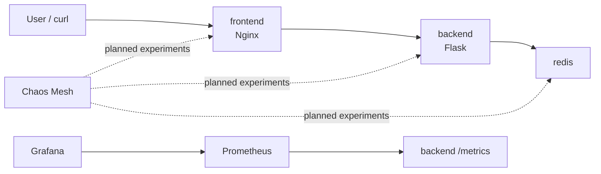
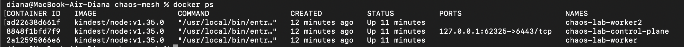
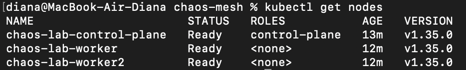
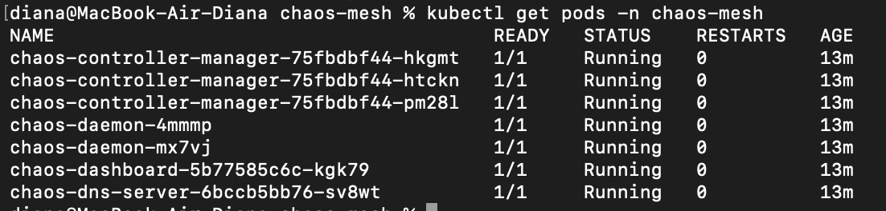
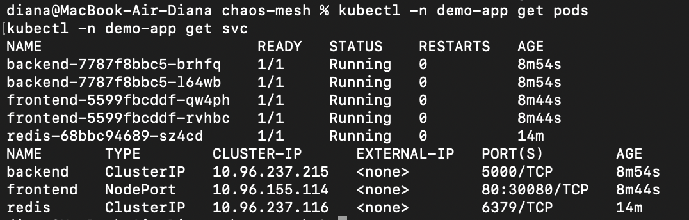
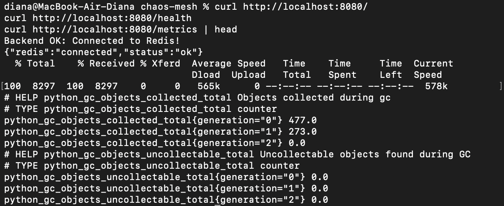
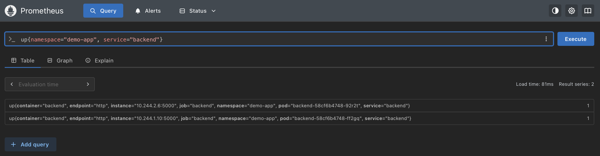
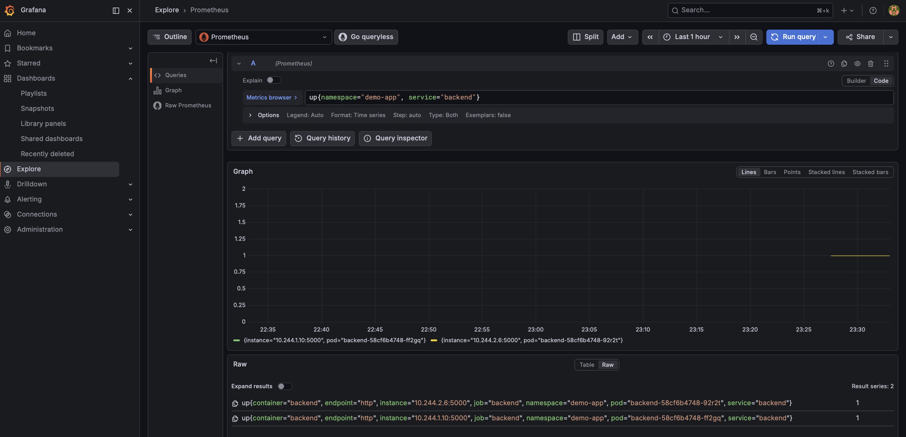

# chaos-mesh
Lab-ready chaos engineering environment built with Kubernetes (Kind) and Chaos Mesh for resilience testing of multi-service applications under pod failures, network partitions, latency injection, and CPU/memory stress conditions.
# Chaos Engineering: Resilience Testing with Chaos Mesh

This project provides a lab-ready environment for testing the resilience of a multi-service application running on Kubernetes. The cluster is created locally with Kind, monitoring is based on Prometheus and Grafana, and failures are injected with Chaos Mesh.

The goal of the project is to demonstrate:

- how to deploy a `frontend` + `backend` + `redis` application on Kubernetes;
- how collected metrics describe the normal state of the system;
- how different failure modes affect the application;
- how the system recovers after each experiment is stopped.

Planned chaos engineering scenarios:

- pod kill;
- network partition;
- latency injection;
- CPU stress;
- memory stress.

## Architecture

The application consists of three services running in the `demo-app` namespace:

- `frontend` - an Nginx service that receives user traffic and forwards it to the backend;
- `backend` - a Flask application that communicates with Redis;
- `redis` - a cache/database used by the backend.

Monitoring is provided by Prometheus and Grafana. Chaos Mesh is used to inject controlled failures into selected application components.



## Repository Structure

```text
.
├── app/manifests/              # Kubernetes manifests for the demo application
├── infrastructure/             # Kind cluster configuration
├── monitoring/                 # Prometheus/Grafana configuration
├── chaos-experiments/          # Chaos Mesh experiments
├── setup.sh                    # Cluster creation and Chaos Mesh installation
└── README.md
```

## Requirements

The following tools are required to run the project locally:

- Docker Desktop;
- Kind;
- kubectl;
- Helm.

Install the tools on macOS:

```bash
brew install kind kubectl helm
```

Check the installation:

```bash
docker --version
kind version
kubectl version --client
helm version
```

Docker Desktop must be running before creating the Kind cluster. Docker can be checked with:

```bash
docker ps
```

## Start the Kind Cluster and Chaos Mesh

Make the setup script executable:

```bash
chmod +x setup.sh
```

Create the Kind cluster and install Chaos Mesh:

```bash
./setup.sh
```

Check the cluster:

```bash
kubectl cluster-info --context kind-chaos-lab
kubectl get nodes
kubectl get pods -A
```

Expected result:

- the `chaos-lab` cluster is active;
- one `control-plane` node and two `worker` nodes are visible;
- Chaos Mesh components are running in the `chaos-mesh` namespace.

## Deploy the Demo Application

Create the namespace first, then deploy the remaining manifests. This avoids errors where `backend`, `frontend`, or `redis` are created before the `demo-app` namespace is available.

```bash
kubectl apply -f app/manifests/namespace.yaml
kubectl apply -f app/manifests/redis.yaml
kubectl apply -f app/manifests/backend.yaml
kubectl apply -f app/manifests/frontend.yaml
```

Check pods and services:

```bash
kubectl -n demo-app get pods
kubectl -n demo-app get svc
```

Expected state:

| Component | Expected state |
|---|---|
| `frontend` | 2 replicas in `Running` state |
| `backend` | 2 replicas in `Running` state |
| `redis` | 1 replica in `Running` state |
| `frontend` service | exposed as `NodePort` or accessible through port-forward |
| `backend` service | accessible inside the cluster |
| `redis` service | accessible inside the cluster |

Access the application locally with port-forward:

```bash
kubectl -n demo-app port-forward svc/frontend 8080:80
```

Test the application:

```bash
curl http://localhost:8080/
```

Expected response:

```text
Backend OK: Connected to Redis!
```

## Health and Application Metrics

The backend should expose basic endpoints:

| Endpoint | Purpose |
|---|---|
| `/` | Main application path and Redis connection check |
| `/health` | Backend and Redis health check |
| `/metrics` | Metrics endpoint for Prometheus |

Example tests:

```bash
curl http://localhost:8080/
curl http://localhost:8080/health
```

The `/metrics` endpoint is exposed by the backend through `prometheus-flask-exporter` and can be scraped by Prometheus.

Metrics that should be visible after Prometheus is connected:

- number of HTTP requests;
- backend response time;
- number of HTTP errors;
- pod readiness status;
- container restart count;
- CPU usage;
- memory usage.

Status:

```text
Implemented: the backend exposes /health and /metrics.
```

## Prometheus and Grafana

Install Prometheus/Grafana:

```bash
helm repo add prometheus-community https://prometheus-community.github.io/helm-charts
helm repo update

helm upgrade --install monitoring prometheus-community/kube-prometheus-stack \
  --namespace monitoring \
  --create-namespace \
  -f monitoring/prometheus-values.yaml
```

Apply the backend `ServiceMonitor` so Prometheus can scrape `/metrics`:

```bash
kubectl apply -f monitoring/backend-servicemonitor.yaml
```

Check the monitoring stack:

```bash
kubectl -n monitoring get pods
kubectl -n monitoring get svc
kubectl -n monitoring get servicemonitor backend
```

Access Prometheus:

```bash
kubectl -n monitoring port-forward svc/monitoring-kube-prometheus-prometheus 9090:9090
```

Prometheus URL:

```text
http://localhost:9090
```

Access Grafana:

```bash
kubectl -n monitoring port-forward svc/monitoring-grafana 3000:80
```

Login details:

| Field | Value |
|---|---|
| URL | `http://localhost:3000` |
| Username | `admin` |
| Password | `admin` |

Status:

```text
Implemented as documented steps.
Prometheus/Grafana are installed through kube-prometheus-stack.
The backend ServiceMonitor is defined in monitoring/backend-servicemonitor.yaml.
```

## Example Prometheus Queries

Application pod readiness:

```promql
kube_pod_status_ready{namespace="demo-app"}
```

Container restarts:

```promql
kube_pod_container_status_restarts_total{namespace="demo-app"}
```

CPU usage:

```promql
rate(container_cpu_usage_seconds_total{namespace="demo-app"}[1m])
```

Memory usage:

```promql
container_memory_working_set_bytes{namespace="demo-app"}
```

Prometheus target availability:

```promql
up
```

Backend scrape target:

```promql
up{namespace="demo-app", service="backend"}
```

Backend HTTP request rate:

```promql
rate(flask_http_request_total[1m])
```

Backend request duration counter:

```promql
flask_http_request_duration_seconds_count
```

## Baseline Before Experiments

The baseline represents the normal state of the application before failure injection.

Commands for collecting the baseline:

```bash
kubectl -n demo-app get pods
kubectl -n demo-app get svc
curl http://localhost:8080/
curl http://localhost:8080/health
```

Expected baseline:

| Area | Expected state |
|---|---|
| Pods | All pods in the `demo-app` namespace are `Running` |
| Frontend | Responds to requests through port-forward |
| Backend | Returns the `Backend OK: Connected to Redis!` response |
| Redis | Backend can connect to Redis |
| Restarts | Restart count does not increase |
| CPU | CPU usage is stable |
| Memory | Memory usage is stable |
| Latency | Response time is low and stable |

Baseline screenshots are included in the Screenshots section.

The Prometheus and Grafana baseline use this query:

```promql
up{namespace="demo-app", service="backend"}
```

## Chaos Mesh Experiments

Chaos Mesh experiments are stored in the `chaos-experiments/` directory. Their purpose is to show how the application behaves during controlled failures and how it recovers after each experiment is stopped.

Current status:

| Experiment | File | Status |
|---|---|---|
| Pod kill | `chaos-experiments/01-pod-kill.yaml` | partially ready |
| Network partition | `chaos-experiments/02-network-partition.yaml` | TODO |
| Latency injection | `chaos-experiments/03-latency-injection.yaml` | TODO |
| CPU stress | `chaos-experiments/04-cpu-stress.yaml` | TODO |
| Memory stress | TODO | TODO |

Target observation table:

| Failure mode | Expected symptoms | Metrics to observe | Recovery behavior |
|---|---|---|---|
| Pod kill | TODO | TODO | TODO |
| Network partition | TODO | TODO | TODO |
| Latency injection | TODO | TODO | TODO |
| CPU stress | TODO | TODO | TODO |
| Memory stress | TODO | TODO | TODO |

## Screenshots

Screenshots should be stored in:

```text
docs/screenshots/
```

Recommended file names:

```text
docs/screenshots/
├── 01-docker-running.png
├── 02-kind-nodes.png
├── 03-chaos-mesh-pods.png
├── 04-demo-app-pods-and-services.png
├── 05-app-response.png
├── 06-prometheus-baseline.png
└── 07-grafana-baseline.png
```

### Environment setup

Docker running:



Kind cluster nodes:



Chaos Mesh pods:



Demo application pods and services:



Application response:



### Monitoring baseline

Prometheus baseline:



Grafana baseline:



### Chaos experiments

TODO: add screenshots showing metrics during:

- pod kill;
- network partition;
- latency injection;
- CPU stress;
- memory stress;
- recovery after experiments.

## Conclusions

The project shows how to prepare a local Kubernetes environment for resilience testing of a multi-service application. The application and monitoring are started first, and the collected baseline can then be compared with system behavior during failures injected by Chaos Mesh.

To be completed after running the experiments:

- which failure mode had the highest impact on application availability;
- which metrics showed the issue most clearly;
- how quickly the system returned to the normal state;
- whether replicas and readiness probes were enough for recovery.
